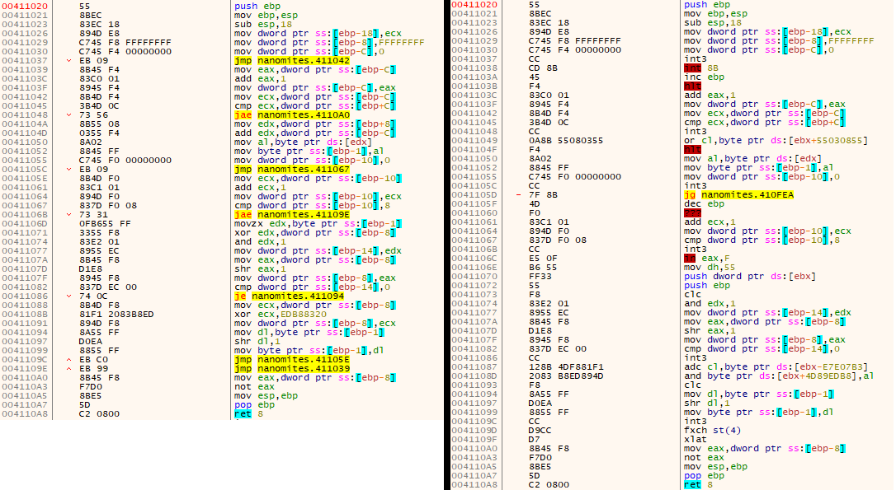

# Fatmike's Nanomites

A custom implementation of the *Nanomites protection technology* for Windows executables (x86 and x64) originally introduced by *Silicon Realms* in 1999 for the *Armadillo Protector*.  

It enhances runtime protection against both static and dynamic analysis by replacing conditional and unconditional jumps with *int 3* (0xCC) instructions, causing *EXCEPTION_BREAKPOINT* exceptions, which are dynamically resolved at runtime without restoring the original instruction bytes.  

*Nanomites* complicate reverse engineering and debugging by obscuring control flow and generating continuous debugging exceptions at *Nanomite* locations, making step-by-step tracing and analysis more difficult.

**Keywords**:  
Exe Protector, Anti-Debug, Anti-Debugging, Obfuscation, Anti-Static-Analysis, Code Section, PE, Portable Executable, EXE, Windows

## Example



**Left**  : Unprotected Code  
**Right** : After *Nanomites* were applied 

## Requirements

- Ability for the programmer to designate specific code segments for protection with *Nanomites*.
- Applying *Nanomites* in a post-build step via a separate tool.

## Concept

Some of the used concepts will be familiar to anyone who has seen my [Just-In-Time Decrypter](https://github.com/Fatmike-GH/JitDecrypter).  
In my implementation, *Nanomites* are applied to the target executable in a post-build step, and a dedicated *Tracer* class manages secure execution at runtime.  

### Marking Code for Nanomites

Marking code for *Nanomites* is achieved through dedicated code sections. In Visual Studio, this can be implemented by applying:

```cpp
__declspec(code_seg(".nano"))
```
at either the ```class ``` or ```method ``` level in the header file.

However, compiler optimizations may override these directives. To prevent this, the ```noinline``` specifier can be used:

```cpp
__declspec(noinline) void ProtectedMethod();
```
Additionally, optimization can be disabled for the relevant implementations in the .cpp file:

```cpp
#pragma optimize( "", off )

ProtectedClass::ProtectedClass()
{
}

ProtectedClass::~ProtectedClass()
{
}

void ProtectedClass::ProtectedMethod()
{
}

#pragma optimize( "", on )
```
This ensures that the instrumentation is preserved and the code executes as intended.

### Resolving *Nanomites* at Runtime

All components required for resolving the *Nanomites* at runtime are encapsulated within the *Tracer* class. The functionality can be activated via the *StartTracing* method and deactivated using *StopTracing*. This approach minimizes the visible overhead within the actual source code logic.

```cpp
// Tracing protected section .nano (protected methods from .nano may be called)
Tracer::Instance().StartTracing(imageBase, nanomitesSection, metadata);
ProtectedClass* protectedClass = new ProtectedClass();
protectedClass->ProtectedMethod();
delete protectedClass;
Tracer::Instance().StopTracing();
```

**StartTracing**

- Activates tracing and allows the execution of protected code within a protected section (*.nano* in the provided example).  
  
**StopTracing**

- Deactivates tracing, disabling execution of protected code and allowing unprotected code to be executed again.

**ProtectedClass**

- A protected class that is linked into the *.nano* section.
  
**ProtectedMethod**

- A protected method that is linked into the *.nano* section.

### Applying Nanomites to Executable Code

Once the target executable has been built, *Nanomites* are applied to the designated code section (e.g., *.nano*) using the *Builder* application, which is also part of the solution. (see below: **Builder Project**)

## Solution Overview

### Builder Project

*Builder.exe* is an auxiliary tool responsible for applying *Nanomites* to the *.nano* section after the target application has been built. It is configured to run automatically as a post-build event. Therefore, make sure to **rebuild** the solution after modifying the source code.

During this process, all relative jump instructions are replaced with *int 3* (0xCC) breakpoints. The [Zydis](https://github.com/zyantific/zydis) disassembler is used for instruction decoding and analysis.  

To allow the target application to resolve *Nanomites* at runtime, metadata is generated and appended to the executable as a resource. This metadata contains the information required to locate and resolve each *Nanomite* during execution time. To raise the bar for reverse engineers, additional decoy *Nanomite* entries are also included in the metadata — attempting to blindly resolve *Nanomites* using only the metadata (for example, by manually following every entry) will most likely cause the application to crash. Note that this is a proof-of-concept tactic to complicate manual resolution and remains improvable.

```cpp
struct Nanomite         // Metadata structure for each individual Nanomite; appended to the target executable as a resource
{
    DWORD Rva;          // Relative Virtual Address of the Nanomite location (relative to the module's ImageBase)
    DWORD JumpType;     // Enum value representing the type of jump (e.g., JMP, JNZ, JE, etc.)
    DWORD JumpLength;   // Relative destination displacement (in bytes) used by the jump
    DWORD OpcodeLength; // Length in bytes of the original instruction sequence replaced by the Nanomite
};
```

### Nanomites Project

This project provides components for resolving *Nanomites* in protected code sections at runtime without restoring the original instruction bytes. Protected code can execute on demand, while standard, unprotected code continues to run normally. The project also includes demonstration code as a proof of concept.

#### Core Class: Tracer

The central component of the *Nanomites Project* is the *Tracer* class. Activating it via the *StartTracing* method enables execution of protected code in a protected section, while deactivating it with *StopTracing* restores normal code execution.

In the *StartTracing* method, a *VectoredExceptionHandler* is registered to handle *EXCEPTION_BREAKPOINT* exceptions triggered by *Nanomites*. The handler uses the metadata (see above) to locate the corresponding *Nanomite* by RVA and checks the CPU register flags to decide whether to execute the jump (see *Tracer::ExecuteJump*). The EIP/RIP is then updated to implement the original jump instruction that was replaced by the *Nanomite*.

Details on the register flags for all supported jumps can be found in the Appendix.

#### Demo Code

As a demonstration, the following code is included:

- The user can input text.
- The input is then processed to compute its CRC32 value.

Both functions are protected within the encrypted *.nano* section.

## Additional Considerations

In this conceptual solution it is unsatisfactory that the user must manage not only the sections to be protected but also the invocation of the *Tracer* class. In a production-ready implementation, this responsibility could be delegated to a separate *Protector* application:

**Target**
  - Within the *Target* code, only the sections intended for protection need to be marked.  
  
**Protector**
  - The *Protector* wraps the *Target* with a loader stub capable of loading the *Target* via manual mapping.
  - By loading the *Target* itself, the loader stub gains full control and can apply the *Tracer* to the protected sections of the *Target* automatically.  
  
  This design simplifies usage for the developer and centralizes protection responsibilities within the Protector application.

  ### Implementation

  These ideas were implemented as a proof of concept in one of my crackmes. The protector uses a concept similar to my packer [Fatpack](https://github.com/Fatmike-GH/Fatpack) and relies on my [manual mapper ](https://github.com/Fatmike-GH/PELoader).  
  
**crackmes.one**
  - [Fatmike's Crackme #7](https://crackmes.one/crackme/67814b594d850ac5f7dc4fc9)  
  
**crackmy.app**
  - [Fatmike's Crackme #7](https://crackmy.app/crackmes/fatmike-s-crackme-7-2025-2634)

## Appendix

### x86 Conditional and Unconditional Jump Instructions

| Instruction | Description | Signedness | Flags | Opcode (short / near) | Length (short / near) |
|--------------|--------------|-------------|--------|-----------------------|------------------------|
| JO | Jump if overflow | – | OF = 1 | 70 / 0F 80 | 2 / 6 |
| JNO | Jump if not overflow | – | OF = 0 | 71 / 0F 81 | 2 / 6 |
| JS | Jump if sign | – | SF = 1 | 78 / 0F 88 | 2 / 6 |
| JNS | Jump if not sign | – | SF = 0 | 79 / 0F 89 | 2 / 6 |
| JE / JZ | Jump if equal / zero | – | ZF = 1 | 74 / 0F 84 | 2 / 6 |
| JNE / JNZ | Jump if not equal / not zero | – | ZF = 0 | 75 / 0F 85 | 2 / 6 |
| JB / JNAE / JC | Jump if below / not above or equal / carry | Unsigned | CF = 1 | 72 / 0F 82 | 2 / 6 |
| JNB / JAE / JNC | Jump if not below / above or equal / not carry | Unsigned | CF = 0 | 73 / 0F 83 | 2 / 6 |
| JBE / JNA | Jump if below or equal / not above | Unsigned | CF = 1 or ZF = 1 | 76 / 0F 86 | 2 / 6 |
| JA / JNBE | Jump if above / not below or equal | Unsigned | CF = 0 and ZF = 0 | 77 / 0F 87 | 2 / 6 |
| JL / JNGE | Jump if less / not greater or equal | Signed | SF ≠ OF | 7C / 0F 8C | 2 / 6 |
| JGE / JNL | Jump if greater or equal / not less | Signed | SF = OF | 7D / 0F 8D | 2 / 6 |
| JLE / JNG | Jump if less or equal / not greater | Signed | ZF = 1 or SF ≠ OF | 7E / 0F 8E | 2 / 6 |
| JG / JNLE | Jump if greater / not less or equal | Signed | ZF = 0 and SF = OF | 7F / 0F 8F | 2 / 6 |
| JP / JPE | Jump if parity even | – | PF = 1 | 7A / 0F 8A | 2 / 6 |
| JNP / JPO | Jump if parity odd | – | PF = 0 | 7B / 0F 8B | 2 / 6 |
| JCXZ | Jump if CX = 0 | – | – | E3 | 2 |
| JECXZ | Jump if ECX = 0 | – | – | E3 | 2 |
| **JMP_S** | **Unconditional short jump** | – | – | **EB** | **2** |
| **JMP_N** | **Unconditional near jump** | – | – | **E9** | **5** |

> **x86 notes:**  
> - Conditional jumps: short = 2 bytes, near = 6 bytes.  
> - Unconditional jumps: JMP_S (short) = 2 bytes, JMP_N (near) = 5 bytes.  
> - All jumps are **relative**, except for far-jump forms not listed here.

---

### x64 Conditional and Unconditional Jump Instructions

| Instruction | Description | Signedness | Flags | Opcode (short / near) | Length (short / near) |
|--------------|--------------|-------------|--------|-----------------------|------------------------|
| JO | Jump if overflow | – | OF = 1 | 70 / 0F 80 | 2 / 6 |
| JNO | Jump if not overflow | – | OF = 0 | 71 / 0F 81 | 2 / 6 |
| JS | Jump if sign | – | SF = 1 | 78 / 0F 88 | 2 / 6 |
| JNS | Jump if not sign | – | SF = 0 | 79 / 0F 89 | 2 / 6 |
| JE / JZ | Jump if equal / zero | – | ZF = 1 | 74 / 0F 84 | 2 / 6 |
| JNE / JNZ | Jump if not equal / not zero | – | ZF = 0 | 75 / 0F 85 | 2 / 6 |
| JB / JNAE / JC | Jump if below / not above or equal / carry | Unsigned | CF = 1 | 72 / 0F 82 | 2 / 6 |
| JNB / JAE / JNC | Jump if not below / above or equal / not carry | Unsigned | CF = 0 | 73 / 0F 83 | 2 / 6 |
| JBE / JNA | Jump if below or equal / not above | Unsigned | CF = 1 or ZF = 1 | 76 / 0F 86 | 2 / 6 |
| JA / JNBE | Jump if above / not below or equal | Unsigned | CF = 0 and ZF = 0 | 77 / 0F 87 | 2 / 6 |
| JL / JNGE | Jump if less / not greater or equal | Signed | SF ≠ OF | 7C / 0F 8C | 2 / 6 |
| JGE / JNL | Jump if greater or equal / not less | Signed | SF = OF | 7D / 0F 8D | 2 / 6 |
| JLE / JNG | Jump if less or equal / not greater | Signed | ZF = 1 or SF ≠ OF | 7E / 0F 8E | 2 / 6 |
| JG / JNLE | Jump if greater / not less or equal | Signed | ZF = 0 and SF = OF | 7F / 0F 8F | 2 / 6 |
| JP / JPE | Jump if parity even | – | PF = 1 | 7A / 0F 8A | 2 / 6 |
| JNP / JPO | Jump if parity odd | – | PF = 0 | 7B / 0F 8B | 2 / 6 |
| JCXZ | Jump if CX = 0 | – | – | E3 | 2 |
| JECXZ | Jump if ECX = 0 | – | – | E3 | 2 |
| **JRCXZ** | **Jump if RCX = 0 (x64 only)** | – | – | **E3** | **2** |
| **JMP_S** | **Unconditional short jump** | – | – | **EB** | **2** |
| **JMP_N** | **Unconditional near jump** | – | – | **E9** | **5** |

> **x64 notes:**  
> - Encodings identical to x86.  
> - No far jumps in long mode — all are **relative**.  
> - `JRCXZ` is unique to x64, checking 64-bit RCX.
